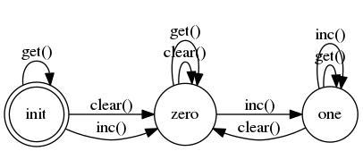

# Counter

Various approaches for stateful property testing with stream_data and
PropCheck (i.e. PropEr).

The main system under test is the `Counter`, which is a simple counting process
with a reset function (`clear()`).

The initial models are state machines, which distinguish between the initial state,
the zero state and the one state, which maps all counting values above zero
into one state to make it easier to reason about the counting. The state machine
is shown in the following image:



A second system under test is the sequential cache, ported from
[Proper Testing in Erlang](http://propertesting.com/book_stateful_properties.html)
to Elixir. The test cases are a direct translation to PropCheck and StreamData.

## Open issues of the StreamData based implementation

* the history cannot be inspected easily
* aggregation of commands is missing (generally in StreamData)

## Installation

If [available in Hex](https://hex.pm/docs/publish), the package can be installed
by adding `counter` to your list of dependencies in `mix.exs`:

```elixir
def deps do
  [
    {:counter, "~> 0.1.0"}
  ]
end
```

Documentation can be generated with [ExDoc](https://github.com/elixir-lang/ex_doc)
and published on [HexDocs](https://hexdocs.pm). Once published, the docs can
be found at [https://hexdocs.pm/counter](https://hexdocs.pm/counter).
